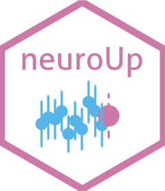

<!-- README.md is generated from README.Rmd. Please edit that file -->

# neuroUp <a href="https://eduardklap.github.io/neuroUp/"></a>

<!-- badges: start -->

[](https://github.com/eduardklap/neuroUp/actions/workflows/R-CMD-check.yaml)
[](https://app.codecov.io/gh/eduardklap/neuroUp?branch=main)
[](https://doi.org/10.5281/zenodo.11526169)
<!-- badges: end -->

## Overview

The goal of neuroUp is to perform empirical sample size determination
and Bayesian updating for region of interest based task-related fMRI
studies.

## Installation

You can install the development version of neuroUp from
[GitHub](https://github.com/) with:

``` r
# install.packages("devtools")
devtools::install_github("eduardklap/neuroUp")
```

## Citation

To cite package neuroUp in publications use:

Klapwijk, E., Hoijtink, H., & Jongerling, J. (2024). neuroUp: Plan
sample size for fMRI regions of interest research using Bayesian
updating. <https://doi.org/10.5281/zenodo.11526169>
